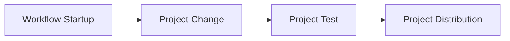

[](https://github.com/cnpryer/huak/actions/workflows/ci-rust.yaml)
[](https://discord.gg/St3menxFZT)

# huak

<div align="center">


</div>

<br>

## About

A Python package manager written in Rust. The [Cargo](https://github.com/rust-lang/cargo) for Python.

> ⚠️ Disclaimer: `huak` is in an experimental state.

Huak aims to support a base workflow for developing Python packages and projects. The process is linear and purpose oriented, establishing better familiarization with the steps.



See the [design doc](/docs/design_doc.md) for more workflow details.

The goal is to create an opinionated tool to support a reliably inviting onboarding experience for the Python ecosystem, that feels responsive and snappy to use.

### Project Status

See **[the milestone list](https://github.com/cnpryer/huak/milestones)** to check the status of this project at any point in time.

## README Contents

- [Installation](#installation)
- [Documentation](#documentation)
- [Goals and Motivation](#goals)
- [Contributing](#contributing)
- [More](#more)

## Installation

A PoC, Alpha releases, and an 0.1.0 are expected.

During the [Alpha phase](https://github.com/cnpryer/huak/milestones) you'll need to explicitly install the latest pre-release available.

Install with `pip`:

`❯ pip install huak --pre`

Around 0.1.0 you'll be able to install `huak` using `brew`. More distribution plans will be finalized closer to 0.1.0.

```console
❯ huak help

A Python package manager written in Rust inspired by Cargo.

Usage: huak <COMMAND>

Commands:
  activate  Activate the project's virtual environment
  add       Add a dependency to the existing project
  audit     Check for vulnerable dependencies and license compatibility*
  build     Build tarball and wheel for the project
  config    Interact with the configuration of huak
  clean     Remove tarball and wheel from the built project
  doc       Generates documentation for the project*
  fix       Auto-fix fixable lint conflicts
  fmt       Format the project's Python code
  init      Initialize the existing project
  install   Install the dependencies of an existing project
  lint      Lint the project's Python code
  new       Create a new project at <path>
  publish   Builds and uploads current project to a registry*
  remove    Remove a dependency from the project
  run       Run a command within the project's environment context
  test      Test the project's Python code
  update    Update dependencies added to the project*
  version   Display the version of the project
  help      Print this message or the help of the given subcommand(s)

Options:
  -h, --help     Print help
  -V, --version  Print version
```
_"*" indicates first-pass of implementation is incomplete._

Note that `huak activate` is currently only partially supported on Windows. See the related [issue](https://github.com/cnpryer/huak/issues/302) for more details.

## Documentation

If you've cloned the repository, run `cargo doc --open`.

Some documentation for 0.0.x releases will land on docs.rs. Around the 0.1.0 release I'd like to have more robust documentation about Huak for users, contributors, and the curious.

## Goals

Besides some of my own experience with the Python ecosystem, there are a few additional guiding principles steering the development of Huak:

### 1. Open to open source 📚

Open source has done a lot for me both from a tooling and professional development perspective. I'd love to offer Huak as a way to help onboard the absolute and relative newcomers (like myself).

### 2. Just use `huak` ✨

I love Rust's onboarding experience. Cargo has played a large role. It's a great tool for newcomers to use to get their feet wet. Huak can provide the same experience for Python.

### 3. Fast ⚡️

There's room for faster tooling in the Python ecosystem. One of the guiding principles will be "Is this the fastest it can be?".

### 4. Python 🤝 Rust

JavaScript has seen a "Going Rust" sub-community pop up. Python seems to be getting one too. Huak would be able to fuel contributions to the intersection of these two languages.

## Contributing

Please read our [contributing guide](/docs/CONTRIBUTING.md) before you start contributing.

## More

See the [design doc](/docs/design_doc.md) for more about the project, design motivations, and various architecture docs.
