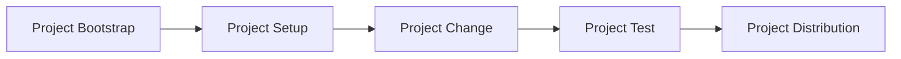

[](https://github.com/cnpryer/huak/actions/workflows/ci-rust.yaml)
[](https://github.com/cnpryer/huak/actions/workflows/ci-python.yaml)
[](https://crates.io/crates/huak)
[](https://discord.gg/St3menxFZT)

# huak

<div align="center">

<a href="https://docs.rs/crate/huak"></a>

</div>

<br>

## About

A Python package manager written in Rust. The [Cargo](https://github.com/rust-lang/cargo) for Python.

> ⚠️ Disclaimer: `huak` is currently in its [proof-of-concept (PoC) phase](https://github.com/cnpryer/huak/milestones).

Huak aims to support a base workflow for developing Python packages and projects. The process is linear and purpose oriented, establishing better familiarization with the steps.



The goal is to create an opinionated tool to support a reliably inviting onboarding experience for the Python ecosystem, that feels responsive and snappy to use.

### Milestones and Project Board

See either **[this milestone list](https://github.com/cnpryer/huak/milestones)** or **[the issue board](https://github.com/users/cnpryer/projects/5)** to check the status of this project at any point in time.

## README Contents

- [Installation](#installation)
- [Documentation](#documentation)
- [Goals and Motivation](#goals)
- [Contributing](#contributing)
- [Architecture and Design](#architecture-and-design)

## Installation

A PoC and an 0.1.0 are expected.

During the [PoC phase](https://github.com/cnpryer/huak/milestones) you'll need to explicitly install the latest pre-release available.

`❯ cargo install huak --version` [](https://crates.io/crates/huak)


Around 0.1.0 you'll be able to install `huak` using `brew` or `pip`. Distribution plans will be finalized closer to 0.1.0.

```
❯ huak help

A Python package manager written in Rust inspired by Cargo

USAGE:
    huak [SUBCOMMAND]

OPTIONS:
    -h, --help       Print help information
    -V, --version    Print version information

SUBCOMMANDS:
    activate         Activate the project's virtual environment.*
    add              Add a Python module to the existing project.*
    build            Build tarball and wheel for the project.*
    clean            Remove tarball and wheel from the built project.
    clean-pycache    Remove all .pyc files and __pycache__ directories.
    doc              Build the current project's documentation.*
    fmt              Format Python code.
    help             Display Huak commands and general usage information.
    init             Initialize the existing project.
    install          Install the dependencies of an existing project.
    lint             Lint Python code.
    new              Create a project from scratch.
    publish          Build and upload current project to a registry.*
    remove           Remove a dependency from the project.
    run              Run a command within the project's environment context.*
    test             Test Python code.
    update           Update dependencies added to the project.*
    version          Display the version of the project.
    
    # 0.1.0
    audit            Check for just vulnerable dependencies or check
                     everything including license compatibility with
                     your dependencies.*
    fix              Apply auto-fixing to your Python code.*
```
_"*" indicates first-pass of implementation is incomplete._

## Documentation

If you've cloned the repository, run `cargo doc --open`.

Some documentation for 0.0.x releases will land on docs.rs. Around the 0.1.0 release I'd like to have more robust documentation about Huak for users, contributors, and the curious.

## Goals

Besides some of my own experience with the Python ecosystem, there are a few additional guiding principles steering the development of Huak:

### 1. Open to open source 📚

Open source has done a lot for me both from a tooling and professional development perspective. I'd love to offer Huak as a way to help onboard the absolute and relative newcomers (like myself).

### 2. Just use `huak` ✨

I love Rust's onboarding experience. Cargo has played a large role. It's a great tool for newcomers to use to get their feet wet. Huak can provide the same experience for Python.

### 3. Fast ⚡️

There's room for faster tooling in the Python ecosystem. One of the guiding principles will be "Is this the fastest it can be?"

### 4. Python 🤝 Rust

JavaScript has seen a "Going Rust" sub-community pop up. Python seems to be getting one too. Huak would be able to fuel contributions to the intersection of these two languages.

## Contributing

Please read our [contributing guide](/docs/CONTRIBUTING.md) before you start contributing.

## Architecture and Design

See [architecture.md](/docs/architecture.md).
