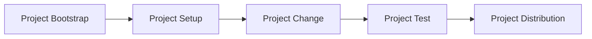

# Architecture

This document is constantly changing while Huak is fresh.

As I become more comfortable with Rust and knowledgeable of the packaging domain, I'll flesh out the general design for Huak more concretely. Until then I want to leave its design open to influence.

- [Design](#design)
  - [Project Workflows](#linear-project-workflows)
  - Huak's Design
- [The Code](#the-code)

## Design

Currently this only covers high level influence for design of the project.

### Linear project workflows

Huak enables and supports a standard *process of developing*. This process is linear. Iteration happens in sequential steps.

#### 1. Project Bootstrap

Quick and easy initilization of a project with opinions on topics like structure and configuration.

#### 2. Project Setup

Adding dependencies, various metadata, etc.. The setup phase is vague but setups up the project for the following steps.

#### 3. Project Change

A change is made to the project.

#### 3. Project Test

The project is evaluated in some form.

#### 4. Project Distribution

The project is distributed for use. This can be publishing to a registry or simply using it locally and executing within its context.

## The Code

Currently the project is structured using the following components:

- A CLI binary (The Huak *Application*)
- Huak's library
  - `configuration` formats
  - `environment`s for contexts
  - `project`s for operation
  - `packaging` for all packaging needs

## Contributing

See [CONTRIBUTING.md](./CONTRIBUTING.md).
