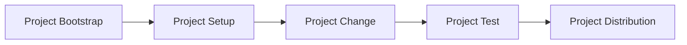

# Contents

- [Contributing](#contributing)
- [Project Workflows](#project-workflows)
- [The Code](#the-code)

## Contributing

See [CONTRIBUTING.md](/docs/CONTRIBUTING.md).

## Project workflows

Huak enables and supports a standard *process of developing*. This process is linear. Iteration happens in sequential steps.



### 1. Project Bootstrap

Quick and easy initialization of a project with opinions on topics like structure and configuration.

### 2. Project Setup

Adding dependencies, various metadata, etc. The setup phase is vague but prepares the project for the following steps.

### 3. Project Change

A change is made to the project.

### 3. Project Test

The project is evaluated in some form.

### 4. Project Distribution

The project is distributed for use. This can be publishing to a registry or simply using it locally and executing within its context.

## The Code

Currently, the project is structured using the following crates:

```bash
crates
├── `huak-cli`              # Huak's CLI
├── `huak-dev`              # Huak's development library
├── `huak-home`             # Huak's home library
├── `huak-package-manager`  # Huak's package management library
├── `huak-python-manager`   # Huak's python management library
├── `huak-toolchain`        # Huak's toolchain management library
└── `huak-workspace`        # Huak's workspace library
```
